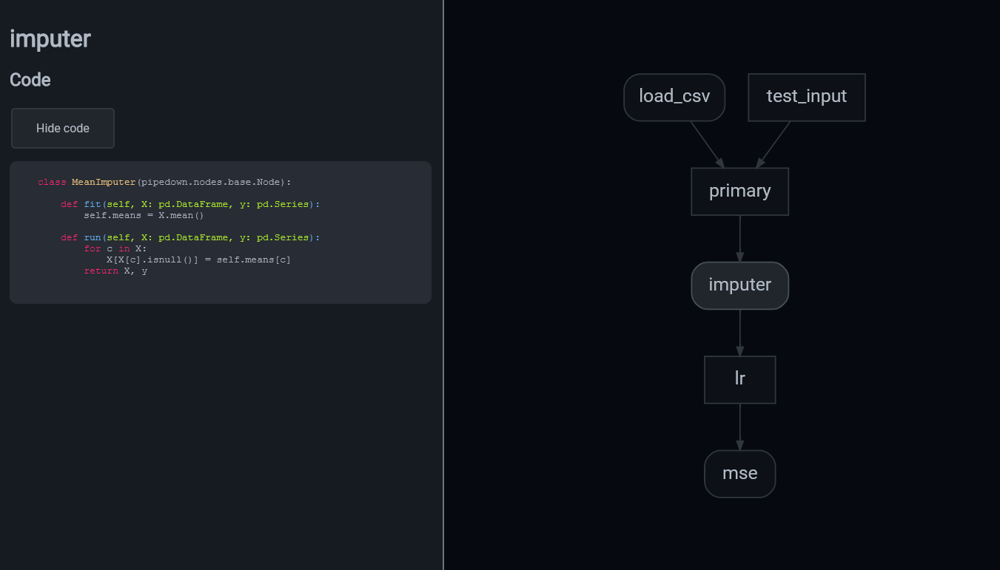

# Pipedown :shushing_face:

[](https://pypi.org/project/pipedown/)
[](https://github.com/brendanhasz/pipedown/actions?query=branch%3Amain)
[](https://codecov.io/gh/brendanhasz/pipedown)

Pipedown is a machine learning model pipelining package for Python.  It doesn't
really *do* much, it just lets you define a directed acyclic graph (DAG) of
modeling steps, each of which is defined as a class with `fit` and `run`
methods (like [scikit-learn](https://scikit-learn.org)), and it runs your nodes
in order and provides a visualization of the DAG.

Pipedown is designed around:

* A **single code path**: use the same code for training, validation, and inference on new test data.
* **Modularity** and **testability**: each node is defined as its own class with `fit()` and `run()` methods, making it easy to unit test each node.
* **Visibility**: pipedown comes with an html viewer to explore the structure of your DAGs, and shows links to the source code associated with each node.
* **Portability**: pipedown models can easily be trained in one environment (e.g. a batch job), serialized, and then loaded into another environment (e.g. a model server) for inference.
* **State**: DAG nodes can store state; they aren't just stateless functions.
* **Flexibility**: pipedown allows you to define models as DAGs instead of just linear pipelines (like [scikit-learn](https://scikit-learn.org/)), but doesn't force your project to have a specific file structure (like [Kedro](https://github.com/quantumblacklabs/kedro)).

Pipedown is NOT an ETL / data engineering / task scheduler tool - for that use
something like Airflow, Argo, Dask, Prefect, etc.  You can do some basic and
inefficient data processing with Pipedown, but really it's focused on creating
portable model pipelines.


* Git repository: [http://github.com/brendanhasz/pipedown](http://github.com/brendanhasz/pipedown)
* Documentation:
* Bug reports: [http://github.com/brendanhasz/pipedown/issues](http://github.com/brendanhasz/pipedown/issues)


## Requirements

To use the visualization tools, you need to have
[graphviz](https://graphviz.org/) installed.  On Ubuntu, you can install with:

```bash
sudo apt-get install graphviz
```

## Installation

Just use pip!

```bash
pip install pipedown
```

## Getting Started

You can define nodes in your pipeline by creating a class which inherits from
`Node`.  Your nodes must define a `run()` method, which performs some
transformation on its input data, and can also optionally define a `fit()`
method to store some state.  For example, a simple node which performs mean
imputation would look like:

```python
import numpy as np
import pandas as pd
import pipedown


class MeanImputer(pipedown.nodes.base.Node):

    def fit(self, X: pd.DataFrame, y: pd.Series):
        self.means = X.mean()

    def run(self, X: pd.DataFrame, y: pd.Series):
        for c in X:
            X[X[c].isnull()] = self.means[c]
        return X, y
```

Or, as another example, a node to load some data from a CSV file:

```python
class LoadFromCsv(pipedown.nodes.base.Node):

    def __init__(self, filename: str):
        self.filename = filename

    def run(self):
        return pd.read_csv(self.filename)
```

Similarly, you can define models by creating a `Model` class with `fit()` and
`predict()` methods:

```python
class LinearRegression(pipedown.nodes.base.Model):

    def fit(self, X: pd.DataFrame, y: pd.Series):
        xx = X.values
        yy = y.values.reshape((-1, 1))
        self.weights = np.linalg.inv(xx.T @ xx) @ xx.T @ yy  # least squares

    def predict(self, X: pd.DataFrame):
        y_pred = X.values @ self.weights
        return pd.Series(data=y_pred.ravel(), index=X.index)
```

And finally, you can assemble your nodes into a directed acyclic graph (DAG) by
creating a class which inherits from `DAG`.  That class should implement a
`nodes()` method, which returns a dictionary of all the nodes in your DAG (keys
are node names, and values are the node objects), and also an `edges()` method,
which returns a dictionary mapping nodes to their parents.

Pipedown also comes with a few built-in nodes which you can use in your DAG,
for example:

* `Input` - to represent test data input
* `Primary` - to split the data into features and the target variable
* Metrics, to evaluate your model's performance

```python
from pipedown.dag import DAG
from pipedown.nodes.base import Input, Primary
from pipedown.nodes.metrics import MeanSquaredError


class MyModel(pipedown.dag.DAG):

    def nodes(self):
        return {
            "load_csv": LoadFromCsv("some_csv.csv"),
            "test_input": Input(),
            "primary": Primary(["feature1", "feature2"], "target"),
            "imputer": MeanImputer(),
            "lr": LinearRegression(),
            "mse": MeanSquaredError(),
        }

    def edges(self):
        return {
            "mse": "lr",
            "lr": "imputer",
            "imputer": "primary",
            "primary": {"test": "test_input", "train": "load_csv"},
        }
```

Then, you can instantiate your DAG and fit the whole thing:

```python
model = MyModel()
model.fit()
```

Run it on new test data:

```pycon
>>> test_input = {"feature1": 1.2, "feature2": 3.4}
>>> model.run(inputs={"test_input": test_input}, outputs="lr")
3.14159
```

Get cross-validated predictions:

```python
cv_predictions = model.cv_predict()
```

Or cross-validated metrics:

```python
model.cv_metric()
```

| model_name | metric_name        | fold | metric_value |
|------------|--------------------|------|--------------|
| lr         | mean_squared_error | 0    | 1.023        |
| lr         | mean_squared_error | 1    | 1.154        |
| lr         | mean_squared_error | 2    | 0.935        |
| lr         | mean_squared_error | 3    | 1.215        |
| lr         | mean_squared_error | 4    | 1.103        |

You can serialize/deserialize the whole model using [cloudpickle](https://github.com/cloudpipe/cloudpickle).

```python
model.save("my_model.pkl")
loaded_model = pipedown.dag.io.load_dag("my_model.pkl")
```

And you can get an html viewer for visualizing the DAG!

```python
# Get the raw html
raw_html = model.get_html()

# Or, save to html file:
model.save_html("my_model.html")
```




## Thanks

Syntax higlighting in the DAG viewer is done using [higlight.js](https://highlightjs.org/)
with the great Atom One Dark ReasonML theme by Gidi Morris / Daniel Gamage.
